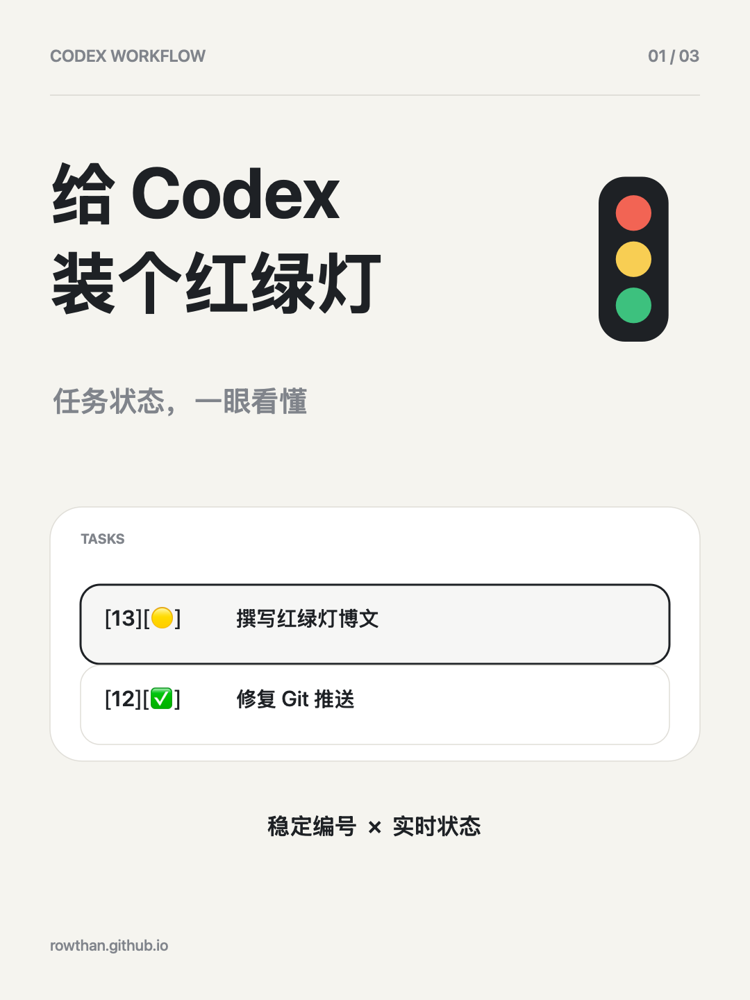
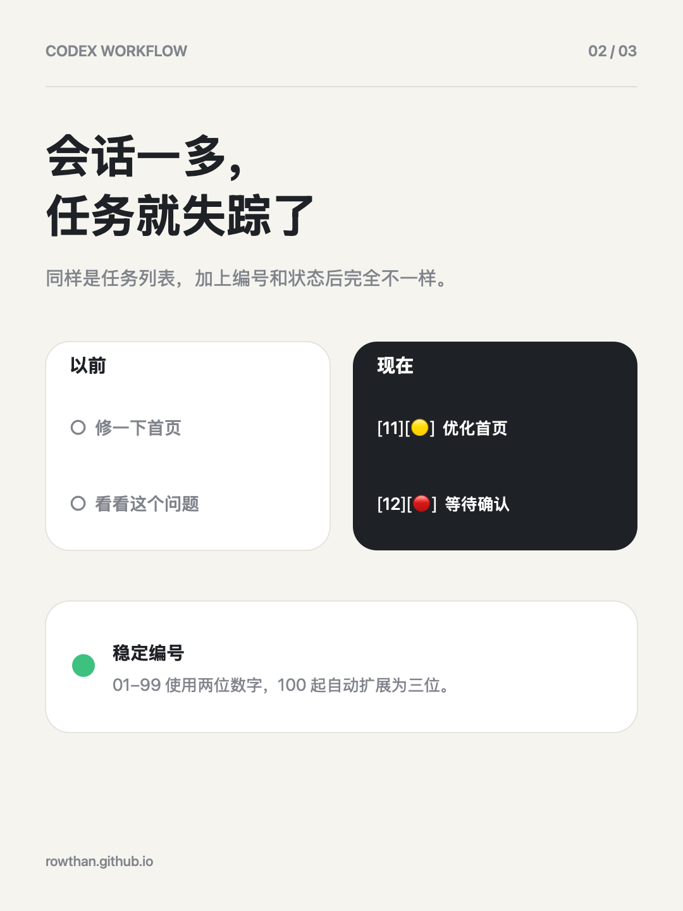
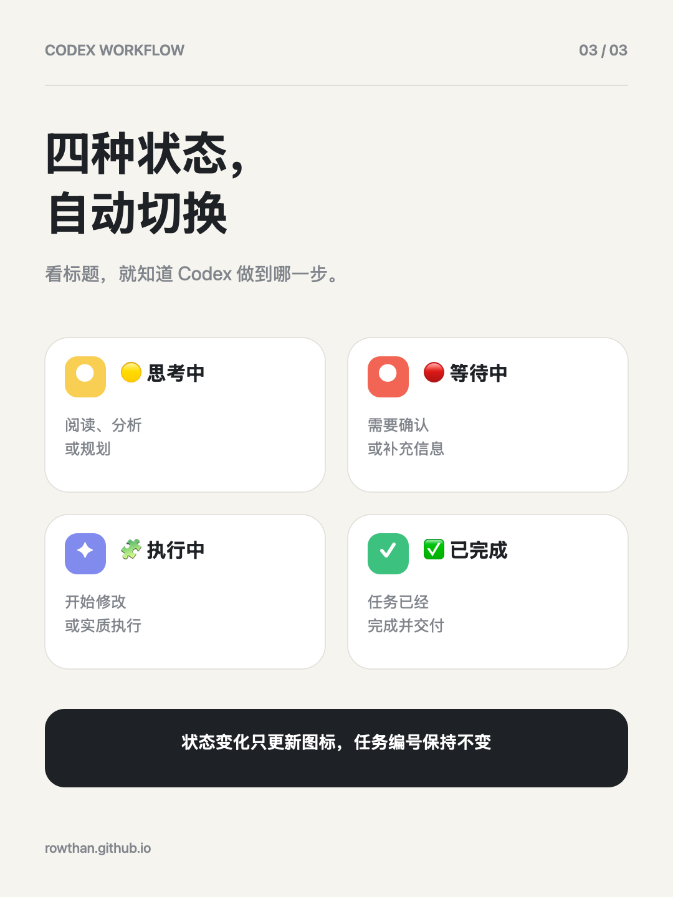

# 给 Codex 装了一个红绿灯🚥

Codex 会话一多，我经常找不到刚才的任务，也很难在一个会话里准确引用另一个会话。

所以我做了一个 `codex-traffic-light` Skill：它会自动给任务标题加上稳定编号和状态图标。`01–99` 使用两位编号，到了 `100` 自动扩展；状态变化只换图标，不改编号。

四种状态：

🟡 思考中：正在阅读、分析或规划  
🔴 等待中：需要我确认或补充信息  
🧩 执行中：已经开始修改或执行  
✅ 已完成：任务已交付

它只在关键节点更新标题，额外开销相对有限。

安装时把这句话发给 Codex：  
安装 Skill 到用户本地：https://tools.markfor.me/skills/codex-traffic-light/SKILL.md

#Codex #AI工具 #效率工具 #开发者日常
